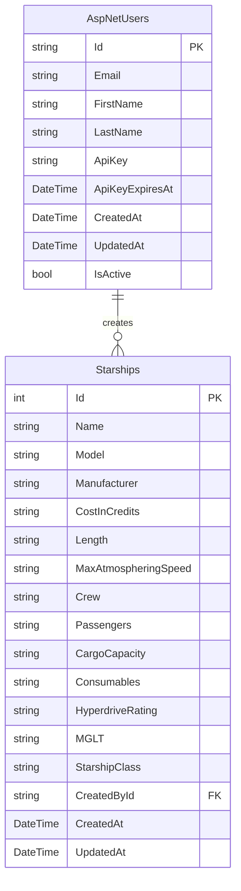

# 🏗️ Development Guide

Complete development documentation for the Star Wars API including architecture, testing, and contribution guidelines.

## Overview

The Star Wars API is built using **Clean Architecture** principles with .NET 8 and ASP.NET Core, emphasizing separation of concerns, testability, and maintainability.

## Architecture Overview

### Clean Architecture Layers

```
┌─────────────────┐
│  Presentation   │  Controllers, Middleware, Filters
├─────────────────┤
│   Application   │  Services, DTOs, Validators
├─────────────────┤
│     Domain      │  Models, Interfaces, Entities
├─────────────────┤
│ Infrastructure  │  Data Access, External APIs, Logging
└─────────────────┘
```

#### 1. Presentation Layer
- **Controllers**: API endpoints and request handling
- **Middleware**: Authentication, logging, error handling
- **Filters**: Cross-cutting concerns like validation
- **DTOs**: Data transfer objects for API communication

#### 2. Application Layer
- **Services**: Business logic and orchestration
- **Validators**: Input validation using FluentValidation
- **Mappers**: AutoMapper configurations
- **Interfaces**: Service contracts

#### 3. Domain Layer
- **Entities**: Core business models
- **Interfaces**: Repository contracts
- **Value Objects**: Immutable objects representing concepts
- **Domain Events**: Business event definitions

#### 4. Infrastructure Layer
- **Repositories**: Data access implementations
- **External Services**: SWAPI integration, email services
- **Logging**: NLog configuration and implementations
- **Database Context**: Entity Framework configurations

## Project Structure

```
Star Wars/
├── Controllers/                 # API Controllers
│   ├── AuthController.cs       # Authentication endpoints
│   ├── ApiKeyController.cs     # API key management
│   ├── StarshipsController.cs  # Starship CRUD operations  
│   ├── SeedController.cs       # Data seeding
│   └── AdminController.cs      # Administrative operations
├── Services/                    # Business Logic Services
│   ├── IAuthService.cs         # Authentication interface
│   ├── AuthService.cs          # Authentication implementation
│   ├── IApiKeyService.cs       # API key interface
│   ├── ApiKeyService.cs        # API key implementation
│   ├── IStarshipService.cs     # Starship interface
│   ├── StarshipService.cs      # Starship implementation
│   └── SwapiService.cs         # External API integration
├── Models/                      # Data Models & DTOs
│   ├── ApplicationUser.cs      # Extended Identity user
│   ├── Starship.cs            # Starship entity
│   ├── DTOs/                  # Data Transfer Objects
│   │   ├── RegisterDto.cs     # Registration request
│   │   ├── LoginDto.cs        # Login request
│   │   ├── StarshipDto.cs     # Starship response
│   │   └── CreateStarshipDto.cs # Starship creation
│   └── Validators/            # FluentValidation rules
│       ├── RegisterDtoValidator.cs
│       └── CreateStarshipDtoValidator.cs
├── Data/                       # Data Access Layer
│   ├── ApplicationDbContext.cs # Entity Framework context
│   ├── Repositories/          # Repository implementations
│   │   ├── IStarshipRepository.cs
│   │   └── StarshipRepository.cs
│   └── Migrations/            # EF Core migrations
├── Middleware/                 # Custom Middleware
│   ├── ApiKeyMiddleware.cs    # API key authentication
│   ├── ErrorHandlingMiddleware.cs # Global error handling
│   └── LoggingMiddleware.cs   # Request/response logging
├── Configuration/              # Application Configuration
│   ├── AutoMapperProfile.cs   # Object mapping configuration
│   ├── ServiceRegistration.cs # DI container setup
│   └── AuthenticationConfig.cs # Auth configuration
├── Tests/                      # Test Projects
│   ├── UnitTests/             # Unit test suite
│   ├── IntegrationTests/      # Integration test suite  
│   └── TestHelpers/           # Test utilities
├── appsettings.json           # Development configuration
├── appsettings.Production.json # Production configuration
├── Program.cs                 # Application entry point
├── Dockerfile                 # Container configuration
├── docker-compose.yml         # Multi-container setup
└── Star Wars.csproj          # Project file
```

## Design Patterns Used

### 1. Repository Pattern
**Purpose**: Abstraction layer between business logic and data access

```csharp
public interface IStarshipRepository
{
    Task<IEnumerable<Starship>> GetAllAsync(int page, int pageSize);
    Task<Starship?> GetByIdAsync(int id);
    Task<Starship> CreateAsync(Starship starship);
    Task<Starship> UpdateAsync(Starship starship);
    Task DeleteAsync(int id);
    Task<IEnumerable<string>> GetManufacturersAsync();
}

public class StarshipRepository : IStarshipRepository
{
    private readonly ApplicationDbContext _context;
    
    // Implementation with EF Core
}
```

### 2. Unit of Work Pattern
**Purpose**: Maintains consistency across multiple repository operations

```csharp
public interface IUnitOfWork : IDisposable
{
    IStarshipRepository Starships { get; }
    Task<int> SaveChangesAsync();
    Task BeginTransactionAsync();
    Task CommitTransactionAsync();
    Task RollbackTransactionAsync();
}
```

### 3. Strategy Pattern (Authentication)
**Purpose**: Multiple authentication strategies (Cookie vs Header)

```csharp
public interface IAuthenticationStrategy
{
    Task<string?> ExtractApiKeyAsync(HttpContext context);
    Task<bool> ValidateAsync(string apiKey);
}

public class CookieAuthenticationStrategy : IAuthenticationStrategy
{
    // Cookie-based authentication implementation
}

public class HeaderAuthenticationStrategy : IAuthenticationStrategy  
{
    // Header-based authentication implementation
}
```

### 4. Factory Pattern (API Keys)
**Purpose**: API key generation with different formats and security levels

```csharp
public interface IApiKeyFactory
{
    string GenerateApiKey(ApiKeyType type, string userId);
    bool ValidateFormat(string apiKey);
}

public class ApiKeyFactory : IApiKeyFactory
{
    public string GenerateApiKey(ApiKeyType type, string userId)
    {
        return type switch
        {
            ApiKeyType.Standard => $"SW-{GenerateSecureToken()}-2024",
            ApiKeyType.Admin => $"SW-ADMIN-{GenerateSecureToken()}-2024",
            _ => throw new ArgumentException("Invalid API key type")
        };
    }
}
```

### 5. Dependency Injection
**Purpose**: Loose coupling and testability

```csharp
// Program.cs service registration
builder.Services.AddScoped<IAuthService, AuthService>();
builder.Services.AddScoped<IApiKeyService, ApiKeyService>();
builder.Services.AddScoped<IStarshipService, StarshipService>();
builder.Services.AddScoped<IStarshipRepository, StarshipRepository>();
builder.Services.AddScoped<IUnitOfWork, UnitOfWork>();
builder.Services.AddHttpClient<SwapiService>();
```

## Database Design

### Entity Relationships



### Database Configuration

```csharp
// ApplicationDbContext.cs
public class ApplicationDbContext : IdentityDbContext<ApplicationUser>
{
    protected override void OnModelCreating(ModelBuilder builder)
    {
        base.OnModelCreating(builder);
        
        // Starship configuration
        builder.Entity<Starship>(entity =>
        {
            entity.HasKey(e => e.Id);
            entity.Property(e => e.Name).IsRequired().HasMaxLength(100);
            entity.Property(e => e.Model).IsRequired().HasMaxLength(100);
            entity.Property(e => e.Manufacturer).IsRequired().HasMaxLength(100);
            
            // Index for performance
            entity.HasIndex(e => e.Name);
            entity.HasIndex(e => e.Manufacturer);
            entity.HasIndex(e => e.StarshipClass);
        });
        
        // User configuration
        builder.Entity<ApplicationUser>(entity =>
        {
            entity.Property(e => e.FirstName).HasMaxLength(50);
            entity.Property(e => e.LastName).HasMaxLength(50);
            entity.Property(e => e.ApiKey).HasMaxLength(100);
            
            // Index for API key lookups
            entity.HasIndex(e => e.ApiKey).IsUnique()
                  .HasFilter("ApiKey IS NOT NULL");
        });
    }
}
```

## Service Layer Implementation

### Authentication Service

```csharp
public interface IAuthService
{
    Task<AuthResponseDto> RegisterAsync(RegisterDto request);
    Task<AuthResponseDto> LoginAsync(LoginDto request);
    Task<bool> ForgotPasswordAsync(ForgotPasswordDto request);
    Task<bool> ResetPasswordAsync(ResetPasswordDto request);
}

public class AuthService : IAuthService
{
    private readonly UserManager<ApplicationUser> _userManager;
    private readonly IApiKeyService _apiKeyService;
    private readonly IEmailService _emailService;
    private readonly ILogger<AuthService> _logger;
    
    public async Task<AuthResponseDto> RegisterAsync(RegisterDto request)
    {
        // 1. Validate input
        var validationResult = await _validator.ValidateAsync(request);
        if (!validationResult.IsValid)
            throw new ValidationException(validationResult.Errors);
            
        // 2. Check for existing user
        var existingUser = await _userManager.FindByEmailAsync(request.Email);
        if (existingUser != null)
            throw new ConflictException("User already exists");
            
        // 3. Create user
        var user = _mapper.Map<ApplicationUser>(request);
        var result = await _userManager.CreateAsync(user, request.Password);
        
        if (!result.Succeeded)
            throw new ApplicationException("User creation failed");
            
        // 4. Generate API key
        var apiKey = await _apiKeyService.GenerateApiKeyAsync(user.Id);
        
        // 5. Return response
        return new AuthResponseDto
        {
            Token = apiKey,
            Email = user.Email,
            FirstName = user.FirstName,
            LastName = user.LastName,
            ExpiresAt = DateTime.UtcNow.AddMinutes(30)
        };
    }
}
```

### Starship Service

```csharp
public interface IStarshipService
{
    Task<PagedResult<StarshipDto>> GetAllAsync(StarshipQueryParameters parameters);
    Task<StarshipDto?> GetByIdAsync(int id);
    Task<StarshipDto> CreateAsync(CreateStarshipDto request, string userId);
    Task<StarshipDto> UpdateAsync(int id, UpdateStarshipDto request, string userId);
    Task DeleteAsync(int id, string userId);
    Task<IEnumerable<string>> GetManufacturersAsync();
    Task<IEnumerable<string>> GetClassesAsync();
}

public class StarshipService : IStarshipService
{
    private readonly IStarshipRepository _repository;
    private readonly IMapper _mapper;
    private readonly ILogger<StarshipService> _logger;
    
    public async Task<PagedResult<StarshipDto>> GetAllAsync(StarshipQueryParameters parameters)
    {
        var starships = await _repository.GetPagedAsync(parameters);
        var totalCount = await _repository.GetCountAsync(parameters);
        
        var starshipDtos = _mapper.Map<IEnumerable<StarshipDto>>(starships);
        
        return new PagedResult<StarshipDto>
        {
            Data = starshipDtos,
            Pagination = new PaginationInfo
            {
                CurrentPage = parameters.Page,
                PageSize = parameters.PageSize,
                TotalPages = (int)Math.Ceiling(totalCount / (double)parameters.PageSize),
                TotalItems = totalCount
            }
        };
    }
}
```

## Testing Framework

### Test Architecture

```
Tests/
├── UnitTests/                    # Isolated unit tests
│   ├── Controllers/             # Controller testing
│   │   ├── AuthControllerTests.cs
│   │   └── StarshipsControllerTests.cs
│   ├── Services/                # Service layer testing
│   │   ├── AuthServiceTests.cs
│   │   └── StarshipServiceTests.cs
│   ├── Middleware/              # Middleware testing
│   │   └── ApiKeyMiddlewareTests.cs
│   └── Validators/              # Validation testing
│       └── RegisterDtoValidatorTests.cs
├── IntegrationTests/            # Full integration tests
│   ├── Controllers/             # End-to-end API testing
│   │   ├── AuthControllerIntegrationTests.cs
│   │   └── StarshipsControllerIntegrationTests.cs
│   ├── Database/                # Database integration
│   │   └── DatabaseIntegrationTests.cs
│   └── Authentication/          # Auth flow testing
│       └── AuthenticationIntegrationTests.cs
└── TestHelpers/                 # Test utilities
    ├── TestWebApplicationFactory.cs
    ├── DatabaseTestHelper.cs
    └── AuthenticationTestHelper.cs
```

### Unit Testing Examples

#### Controller Testing
```csharp
public class StarshipsControllerTests
{
    private readonly Mock<IStarshipService> _mockService;
    private readonly StarshipsController _controller;
    
    public StarshipsControllerTests()
    {
        _mockService = new Mock<IStarshipService>();
        _controller = new StarshipsController(_mockService.Object);
        
        // Setup claims for authorization testing
        var claims = new List<Claim>
        {
            new(ClaimTypes.NameIdentifier, "test-user-id"),
            new(ClaimTypes.Email, "test@example.com")
        };
        var identity = new ClaimsIdentity(claims, "test");
        var principal = new ClaimsPrincipal(identity);
        
        _controller.ControllerContext = new ControllerContext
        {
            HttpContext = new DefaultHttpContext { User = principal }
        };
    }
    
    [Fact]
    public async Task GetStarships_ReturnsPagedResult()
    {
        // Arrange
        var parameters = new StarshipQueryParameters { Page = 1, PageSize = 10 };
        var expectedResult = new PagedResult<StarshipDto>
        {
            Data = new List<StarshipDto> { new() { Id = 1, Name = "Test Ship" } },
            Pagination = new PaginationInfo { CurrentPage = 1, PageSize = 10, TotalItems = 1 }
        };
        
        _mockService.Setup(s => s.GetAllAsync(parameters))
                   .ReturnsAsync(expectedResult);
                   
        // Act
        var result = await _controller.GetStarships(parameters);
        
        // Assert
        var okResult = Assert.IsType<OkObjectResult>(result);
        var pagedResult = Assert.IsType<PagedResult<StarshipDto>>(okResult.Value);
        Assert.Single(pagedResult.Data);
        Assert.Equal("Test Ship", pagedResult.Data.First().Name);
    }
}
```

#### Service Testing
```csharp
public class AuthServiceTests
{
    private readonly Mock<UserManager<ApplicationUser>> _mockUserManager;
    private readonly Mock<IApiKeyService> _mockApiKeyService;
    private readonly Mock<IMapper> _mockMapper;
    private readonly AuthService _authService;
    
    [Fact]
    public async Task RegisterAsync_ValidRequest_ReturnsAuthResponse()
    {
        // Arrange
        var request = new RegisterDto
        {
            FirstName = "Luke",
            LastName = "Skywalker",
            Email = "luke@jedi.com",
            Password = "Password123!"
        };
        
        var user = new ApplicationUser
        {
            Id = "test-id",
            Email = request.Email,
            FirstName = request.FirstName,
            LastName = request.LastName
        };
        
        _mockUserManager.Setup(um => um.FindByEmailAsync(request.Email))
                       .ReturnsAsync((ApplicationUser)null);
                       
        _mockUserManager.Setup(um => um.CreateAsync(It.IsAny<ApplicationUser>(), request.Password))
                       .ReturnsAsync(IdentityResult.Success);
                       
        _mockApiKeyService.Setup(aks => aks.GenerateApiKeyAsync(user.Id))
                         .ReturnsAsync("test-api-key");
                         
        _mockMapper.Setup(m => m.Map<ApplicationUser>(request))
                  .Returns(user);
        
        // Act
        var result = await _authService.RegisterAsync(request);
        
        // Assert
        Assert.NotNull(result);
        Assert.Equal("test-api-key", result.Token);
        Assert.Equal(request.Email, result.Email);
        Assert.Equal(request.FirstName, result.FirstName);
    }
}
```

### Integration Testing

#### Test Web Application Factory
```csharp
public class TestWebApplicationFactory<TProgram> : WebApplicationFactory<TProgram> 
    where TProgram : class
{
    protected override void ConfigureWebHost(IWebHostBuilder builder)
    {
        builder.ConfigureServices(services =>
        {
            // Remove the app's ApplicationDbContext registration
            var descriptor = services.SingleOrDefault(
                d => d.ServiceType == typeof(DbContextOptions<ApplicationDbContext>));
            
            if (descriptor != null)
                services.Remove(descriptor);
                
            // Add ApplicationDbContext using an in-memory database for testing
            services.AddDbContext<ApplicationDbContext>(options =>
            {
                options.UseInMemoryDatabase("InMemoryDbForTesting");
            });
            
            // Build the service provider
            var sp = services.BuildServiceProvider();
            
            // Create a scope to obtain a reference to the database contexts
            using var scope = sp.CreateScope();
            var scopedServices = scope.ServiceProvider;
            var db = scopedServices.GetRequiredService<ApplicationDbContext>();
            
            // Ensure the database is created
            db.Database.EnsureCreated();
            
            // Seed test data
            SeedTestData(db);
        });
    }
    
    private static void SeedTestData(ApplicationDbContext context)
    {
        context.Starships.Add(new Starship
        {
            Name = "Test Starship",
            Model = "Test Model",
            Manufacturer = "Test Manufacturer",
            StarshipClass = "Test Class"
        });
        
        context.SaveChanges();
    }
}
```

#### Integration Test Example
```csharp
public class StarshipsControllerIntegrationTests : IClassFixture<TestWebApplicationFactory<Program>>
{
    private readonly TestWebApplicationFactory<Program> _factory;
    private readonly HttpClient _client;
    
    public StarshipsControllerIntegrationTests(TestWebApplicationFactory<Program> factory)
    {
        _factory = factory;
        _client = factory.CreateClient();
    }
    
    [Fact]
    public async Task GetStarships_WithValidApiKey_ReturnsSuccess()
    {
        // Arrange - Register user and get API key
        var registerRequest = new RegisterDto
        {
            FirstName = "Test",
            LastName = "User",
            Email = "test@example.com",
            Password = "Password123!"
        };
        
        var registerResponse = await _client.PostAsJsonAsync("/api/auth/register", registerRequest);
        var authResult = await registerResponse.Content.ReadFromJsonAsync<AuthResponseDto>();
        
        _client.DefaultRequestHeaders.Add("X-API-Key", authResult.Token);
        
        // Act
        var response = await _client.GetAsync("/api/starships");
        
        // Assert
        response.EnsureSuccessStatusCode();
        var result = await response.Content.ReadFromJsonAsync<PagedResult<StarshipDto>>();
        Assert.NotNull(result);
        Assert.NotEmpty(result.Data);
    }
}
```

### Code Coverage

#### Configuration
```xml
<!-- In test project file -->
<PackageReference Include="coverlet.collector" Version="6.0.0" />
<PackageReference Include="coverlet.msbuild" Version="6.0.0" />
```

#### Generate Coverage Reports
```bash
# Run tests with coverage
dotnet test --collect:"XPlat Code Coverage"

# Generate HTML report
dotnet tool install -g dotnet-reportgenerator-globaltool
reportgenerator -reports:"**/coverage.cobertura.xml" -targetdir:"coverage-report" -reporttypes:Html

# View coverage
open coverage-report/index.html
```

#### Coverage Targets
- **Controllers**: >90% coverage
- **Services**: >95% coverage  
- **Middleware**: >85% coverage
- **Overall**: >80% coverage

## Development Workflow

### Local Development Setup

1. **Clone Repository**
   ```bash
   git clone https://github.com/yourusername/star-wars-api.git
   cd star-wars-api
   ```

2. **Install Dependencies**
   ```bash
   dotnet restore
   ```

3. **Setup Database**
   ```bash
   # Apply migrations
   dotnet ef database update
   
   # Or use Docker
   docker-compose up -d sqlserver
   ```

4. **Run Application**
   ```bash
   dotnet run
   # or
   dotnet watch run  # for hot reload
   ```

5. **Run Tests**
   ```bash
   # All tests
   dotnet test
   
   # Specific test project
   dotnet test Tests/UnitTests
   
   # With coverage
   dotnet test --collect:"XPlat Code Coverage"
   ```

### Git Workflow

#### Branch Strategy
```
main                    # Production-ready code
├── develop            # Integration branch
├── feature/auth-api   # Feature branches
├── feature/starships  # Feature branches
├── hotfix/security    # Critical fixes
└── release/v1.0      # Release preparation
```

#### Commit Message Convention
```
type(scope): description

feat(auth): add password reset functionality
fix(api): resolve starship creation validation
docs(readme): update deployment instructions
test(auth): add integration tests for login
refactor(services): simplify starship service logic
```

### Code Quality Standards

#### EditorConfig
```ini
# .editorconfig
root = true

[*.cs]
indent_style = space
indent_size = 4
end_of_line = crlf
charset = utf-8
trim_trailing_whitespace = true
insert_final_newline = true

# .NET code quality rules
dotnet_analyzer_diagnostic.category-design.severity = warning
dotnet_analyzer_diagnostic.category-maintainability.severity = warning
dotnet_analyzer_diagnostic.category-performance.severity = warning
dotnet_analyzer_diagnostic.category-reliability.severity = error
dotnet_analyzer_diagnostic.category-security.severity = error
```

#### Analyzers Configuration
```xml
<!-- Directory.Build.props -->
<Project>
  <ItemGroup>
    <PackageReference Include="Microsoft.CodeAnalysis.Analyzers" Version="3.3.4" PrivateAssets="all" />
    <PackageReference Include="Microsoft.CodeAnalysis.NetAnalyzers" Version="8.0.0" PrivateAssets="all" />
    <PackageReference Include="SonarAnalyzer.CSharp" Version="9.16.0.82469" PrivateAssets="all" />
  </ItemGroup>
  
  <PropertyGroup>
    <TreatWarningsAsErrors>true</TreatWarningsAsErrors>
    <WarningsAsErrors />
    <WarningsNotAsErrors>CS1591</WarningsNotAsErrors>
  </PropertyGroup>
</Project>
```

## Contributing Guidelines

### Getting Started

1. **Fork the Repository**
   - Click "Fork" on GitHub
   - Clone your fork locally

2. **Create Feature Branch**
   ```bash
   git checkout -b feature/your-feature-name
   ```

3. **Make Changes**
   - Follow coding standards
   - Add/update tests
   - Update documentation

4. **Test Your Changes**
   ```bash
   # Run all tests
   dotnet test
   
   # Check code coverage
   dotnet test --collect:"XPlat Code Coverage"
   
   # Run linting
   dotnet format --verify-no-changes
   ```

5. **Submit Pull Request**
   - Create PR from your fork
   - Fill out PR template
   - Ensure CI passes

### Pull Request Template

```markdown
## Description
Brief description of changes

## Type of Change
- [ ] Bug fix (non-breaking change which fixes an issue)
- [ ] New feature (non-breaking change which adds functionality)
- [ ] Breaking change (fix or feature that would cause existing functionality to not work as expected)
- [ ] Documentation update

## Testing
- [ ] Unit tests added/updated
- [ ] Integration tests added/updated
- [ ] Manual testing performed
- [ ] All tests passing

## Checklist
- [ ] Code follows project style guidelines
- [ ] Self-review completed
- [ ] Code is commented where necessary
- [ ] Documentation updated
- [ ] No new warnings introduced
```

### Code Review Process

1. **Automated Checks**
   - Build success
   - All tests pass
   - Code coverage maintained
   - Linting passes

2. **Manual Review**
   - Code quality and readability
   - Architecture compliance
   - Security considerations
   - Performance implications

3. **Approval & Merge**
   - At least one approval required
   - All CI checks pass
   - Squash and merge preferred

### Development Best Practices

#### 1. SOLID Principles
- **Single Responsibility**: Each class has one reason to change
- **Open/Closed**: Open for extension, closed for modification
- **Liskov Substitution**: Subtypes must be substitutable for base types
- **Interface Segregation**: Many specific interfaces over one general interface
- **Dependency Inversion**: Depend on abstractions, not concretions

#### 2. Error Handling
```csharp
// Use specific exceptions
public class StarshipNotFoundException : NotFoundException
{
    public StarshipNotFoundException(int id) 
        : base($"Starship with ID {id} was not found") { }
}

// Global error handling middleware
public class ErrorHandlingMiddleware
{
    public async Task InvokeAsync(HttpContext context, RequestDelegate next)
    {
        try
        {
            await next(context);
        }
        catch (Exception ex)
        {
            await HandleExceptionAsync(context, ex);
        }
    }
}
```

#### 3. Logging Standards
```csharp
public class StarshipService
{
    private readonly ILogger<StarshipService> _logger;
    
    public async Task<StarshipDto> CreateAsync(CreateStarshipDto request, string userId)
    {
        _logger.LogInformation("Creating starship {Name} for user {UserId}", 
                              request.Name, userId);
        
        try
        {
            var starship = await _repository.CreateAsync(entity);
            
            _logger.LogInformation("Successfully created starship {StarshipId} for user {UserId}", 
                                  starship.Id, userId);
            
            return _mapper.Map<StarshipDto>(starship);
        }
        catch (Exception ex)
        {
            _logger.LogError(ex, "Failed to create starship {Name} for user {UserId}", 
                           request.Name, userId);
            throw;
        }
    }
}
```

#### 4. Performance Considerations
```csharp
// Use async/await throughout
public async Task<IEnumerable<StarshipDto>> GetStarshipsAsync()
{
    var starships = await _repository.GetAllAsync();
    return _mapper.Map<IEnumerable<StarshipDto>>(starships);
}

// Implement pagination
public async Task<PagedResult<StarshipDto>> GetPagedStarshipsAsync(int page, int pageSize)
{
    var totalCount = await _repository.GetCountAsync();
    var starships = await _repository.GetPagedAsync(page, pageSize);
    
    return new PagedResult<StarshipDto>
    {
        Data = _mapper.Map<IEnumerable<StarshipDto>>(starships),
        Pagination = new PaginationInfo(page, pageSize, totalCount)
    };
}
```

---

**[← Back to Main README](../README.md)**
